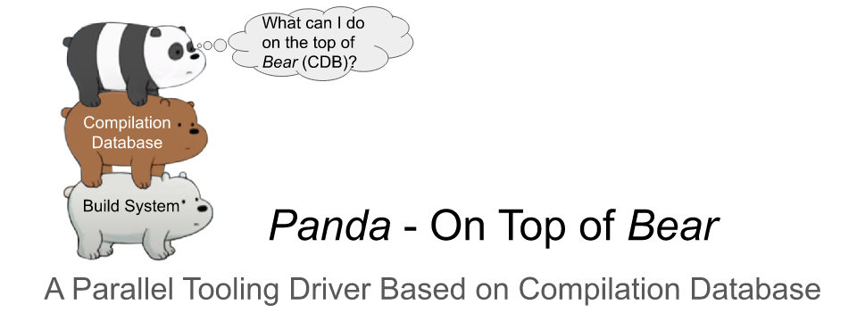

# Panda - On Top of [Bear][link-bear]

*Panda* is a compilation-independent tooling driver
for pipelining compilers and tools in parallel
based on the [JSON compilation database][link-cdb].
It allows you to execute various actions
on specific files
by replaying the compilation process,
such as generating the LLVM Bitcode with *Clang*
and running the *Clang Static Analyzer* to check the given project.

Since all dependencies are generated during compilation,
the tooling process does not need to follow compilation dependency relations.
Scheduling actions independently from compilation,
*Panda* can take full advantage of the system resources
to accelerate the tool execution
and pipeline dependent actions
that are not schedulable with one execution pass
during compilation.

## Installation

*Panda* is a standalone Python script.
You can install it by directly downloading file `panda` from this repo.

```
$ curl -fsSL https://github.com/Snape3058/panda/raw/main/panda | sudo tee /usr/bin/panda >/dev/null
$ sudo chmod +x /usr/bin/panda
```

## Usage

Executing panda by providing the actions to be executed
and number of jobs in parallel.

```
$ panda <actions> [-j JOBS] [-f CDB] [-o OUTPUT] [options]
```

The built-in actions are composed of compilation database actions,
which can generate output directly from the compilation database,
and tooling actions invoking compilers and tools.
These actions can cover most scenes of executing analyzers
and generating desired inputs for analyzers.

* Example 1: Generating external function map and invocation list
    to path `/tmp/csa-ctu-scan` under a concurrency of 16 processes.

```
$ panda -YM -j 16 -o /tmp/csa-ctu-scan
```

* Example 2: Executing a customized plugin description `/tmp/check/action.json`
    and store output to path `/tmp/check` without parallelization.

```
$ panda --plugin /tmp/check/action.json -o /tmp/check
```

### Built-in Compilation Database Actions

The compilation database actions
transform the input compilation database
to generate the output file,
or summarize the output of other tooling actions.

* Generate *input file list* (`-L` or `--gen-input-file-list`):
    a list of all unique `file`s with absolute path.
* Generate *source file list* (`-F` or `--gen-source-file-list`):
    a list of all unique source files and the header files included.
* Generate *invocation list* (`-Y` or `--gen-invocation-list`)
    for Cross Translation Unit Analysis of the *Clang Static Analyzer*
    under [on-demand-parsing][link-odp] strategy.
* Generate *external function map* (`-M` or `--gen-extdef-mapping`)
    for Cross Translation Unit Analysis of the *Clang Static Analyzer*
    under [on-demand-parsing][link-odp] strategy.
* Generate *external function map* (`-P` or `--gen-extdef-mapping-ast`)
    for Cross Translation Unit Analysis of the *Clang Static Analyzer*
    under [AST-loading][link-al] strategy.

### Built-in Compiler Actions

The compiler actions mainly generate inputs in desired formats for different analyzers.

* Test command line arguments and source file syntax (`-X` or `--syntax`):
    compiler action `-fsyntax-only -Wall`
* Re-compile the source file (`-C` or `--compile`):
    compiler action `-c`
* Generate preprocessed source file dump (`-E` or `--preprocess`):
    compiler action `-E`
* Generate Clang PCH format AST dump (`-A` or `--gen-ast`):
    clang compiler action `-emit-ast`
* Generate LLVM Bitcode in binary format (`-B` or `--gen-bc`):
    clang compiler action `-emit-llvm`
* Generate LLVM Bitcode in text cormat (`-R` or `--gen-ll`):
    clang compiler action `-emit-llvm -S`
* Generate assembly dump (`-S` or `--gen-asm`):
    compiler action `-S`
* Generate dependency description dump (`-D` or `--gen-dep`):
    compiler action `-M`
* Execute Clang Static Analyzer without Cross Translation Unit Analysis (`--analysis no-ctu`)

### Built-in Tooling Actions

The tooling actions mainly invoke Clang AST based tools.

* Generating external function map (as mentioned above)
* Execute Clang Static Analyzer with Cross Translation Unit Analysis activated (`--analysis ctu`)

### Action Plugins

Users can execute customized compiler and tooling actions
with plugins defined with an action description in JSON format.
In the description,
field `comment` is a string for commenting the description,
field `type` determines the type of the action (compiler or tooling action),
and object `action` defines the action to be executed.

* Example compiler action of generating dependency files (option `-D` or `--gen-dep`).

```json
{
    "comment": "Example plugin for Panda driver.",
    "type": "CompilerAction",
    "action": {
        "prompt": "Generating dependency file",
        "args": ["-fsyntax-only", "-w", "-M"],
        "extname": ".d",
        "outopt": "-MF"
    }
}
```

For a compiler action, object `action` has four fields.
Field `prompt` defines the prompt string printed during executing the action.
Field `args` is a list of command line arguments to be added during execution.
Field `extname` determines the extension name of the output file.
And field `outopt` represents the option of generating the output.

* Example tooling action of executing Clang Tidy
    with a configuration file `config.txt` in output directory
    and storing command line output of stderr stream to output file.

```json
{
    "comment": "Example plugin for Panda driver",
    "type": "ClangToolAction",
    "action": {
        "prompt": "Generating raw external function map",
        "tool": "clang-tidy",
        "args": ["--config-file=/path/to/output/config.txt"],
        "extname": ".clang-tidy",
        "stream": "stderr"
    }
}
```

For a tooling action, object `action` has five fields.
Field `prompt`, `args`, and `extname` have the same meaning as a compile action.
Field `tool` determines the tool to be executed.
And field `stream` represents
the output of which stream will be stored to the output file.
Please note that, string `/path/to/output` will be always be replaced to
the actual output path determined with option `-o` during execution.

## Acknowledgments

* REST team, Institute of Software, Chinese Academy of Sciences

Let me know if *Panda* helps you. Thanks.


[link-bear]: https://github.com/rizsotto/Bear
[link-cdb]: https://clang.llvm.org/docs/JSONCompilationDatabase.html
[link-al]: https://clang.llvm.org/docs/analyzer/user-docs/CrossTranslationUnit.html#manual-ctu-analysis
[link-odp]: https://clang.llvm.org/docs/analyzer/user-docs/CrossTranslationUnit.html#id2
